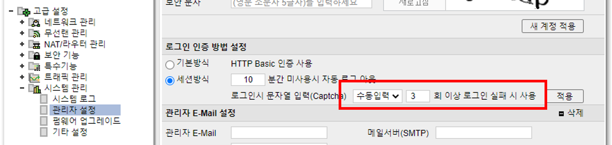
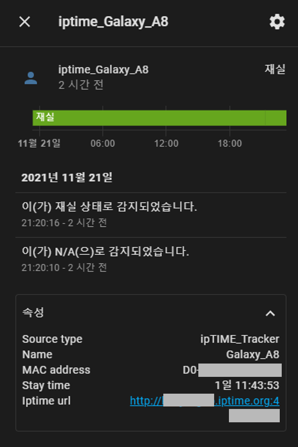

# iptime_tracker
[![hacs_badge][hacs-shield]][github-repository]
[![version_badge][version-shield]][github-repository]
[![BuyMeCoffee][buymecoffee-shield]][buymecoffee]

ipTIME Tracker for Home Assistnat #HA 

### 개요
- ipTIME 공유기의 트래커를 HA Component로 개발하였습니다.
- 공유기 무선랜에 연결된 단말기의 MAC주소를 기반으로 연결 상태를 파악합니다.
- 관리페이지 접속을 위해 문자열 입력(Captcha) 사용을 해제해야합니다.
  - "세션방식 / 수동입력 / 3회 이상 로그인 실패 시 사용"으로 설정하시면 Tracker와 보안을 동시에 챙길 수 있습니다.
<br> => 메뉴 -> 고급 설정 -> 시스템 관리 -> 관리자 설정 -> 로그인 인증 방법 설정
<br>
- Home Assistant 출력
<br>


<br>

## Version History
| Version | Date        | 내용                                                                                 |
| :-----: | :---------: | ------------------------------------------------------------------------------------ |
| v1.0.0  | 2021.08.14  | Release beta version.                                                                |
| v1.0.1  | 2021.11.19  | Modified logging level.                                                              |
| v1.1.0  | 2021.11.22  | Changed algorithm. (Mobile UI -> PC UI) <br> 특징 - Mobile UI: 안정성, PC UI: 호환성  |
| v1.2.0  | 2021.11.22  | Changed algorithm. (PC UI -> Integrated)                                             |
| v1.2.1  | 2021.11.22  | Removed unnecessary log messages.                                                    |
| v1.2.2  | 2021.11.23  | Changed the variable name. (scan_interval -> interval_seconds)                       |
| v1.3.0  | 2021.11.24  | Update to support mesh networks.                                                     |
| v1.3.1  | 2021.11.26  | Fixed bugs related to the Mesh networks.                                             |
| v1.3.2  | 2021.12.27  | Fixed bugs related to the Mesh networks.                                             |
| v1.4.0  | 2023.08.18  | Fixed bugs related to page requests.                                                 |
| v1.5.0  | 2024.05.24  | Update to support Beta UI.                                                           |
| v1.6.0  | 2024.05.27  | Update to support mesh networks for Beta UI.                                         |

<br>

## Installation
### Manual
- HA 설치 경로의 custom_components 폴더에 iptime_tracker 폴더를 복사하여 넣어줍니다.<br>
  `<config directory>/custom_components/iptime_tracker/`<br>
- Home-Assistant 를 재시작합니다<br>
### HACS
- HACS > Integretions > 우측상단 메뉴 > Custom repositories 선택
- 'https://github.com/junskr/iptime_tracker' 주소 입력, Category에 'integration' 선택 후, 저장
- HACS > Integretions 메뉴 선택 후, '[KR] ipTIME Tracker' 검색하여 설치

<br>

## Example configuration (YAML)
### configuration.yaml
- HA 환경설정파일에 아래와 같은 형식으로 입력해주세요.

```yaml
device_tracker:
  - platform: iptime_tracker
    interval_seconds: 10
    iptime_url: 'ipTIME 공유기 관리페이지 주소'
    iptime_id: !secret iptime_id
    iptime_pw: !secret iptime_pw
    targets:
      - name: 'Galaxy'
        mac: 'AA-BB-CC-DD-EE-FF'
      - name: 'Iphone'
        mac: 'BB-CC-DD-EE-FF-AA'        
```

### known_devices.yaml
- 보통 자동으로 **track: true**가 되지만, 만약 구성요소에 Track 디바이스가 표시되지 않는다면 known_devices.yaml를 확인해보세요.

```yaml
iptime_디바이스이름:
  name: iptime_디바이스이름
  mac: 공유기주소_디바이스MAC
  icon:
  picture:
  track: true
```

## Options

Based on latest (pre) release <br>
Configure the sensors that will scrape the data.

| name              | description             | required | default | type          |
| ----------------- | ----------------------- | -------- | ------- | ------------- |
| interval_seconds  | 스캔 간격(초)           | False    |    5    | int           |
| iptime_url        | 공유기 관리페이지       | True     |         | string        |
| iptime_id         | 관리자 아이디           | True     |         | string        |
| iptime_pw         | 관리자 비밀번호         | True     |         | string        |
| targets           | 트래킹 대상 리스트      | True     |         | string - list |
| targets > name    | 트래킹 대상의 표시 이름 | True     |         | string        |
| targets > mac     | 트래킹 대상의 MAC 주소  | True     |         | string        |

<br>

## Contributions are welcome!
커피 한잔의 후원은 개발자가 더욱 적극적으로 일할 수 있게 도와줍니다 :)

### 카카오 후원
<a href="https://qr.kakaopay.com/281006011000008928577354" target="_blank"></a>

<br><br>

### 토스 후원
<a href="supertoss://send?amount=0&bank=%EC%B9%B4%EC%B9%B4%EC%98%A4%EB%B1%85%ED%81%AC&accountNo=3333025959265&origin=qr" target="_blank"></a>

<br><br>

### 커피 후원
<a href="https://www.buymeacoffee.com/junskr" target="_blank"></a>

---

[hacs-shield]: https://img.shields.io/badge/HACS-Custom-41BDF5
[version-shield]: https://img.shields.io/badge/version-v1.6.0-blue
[buymecoffee-shield]: https://img.shields.io/badge/buy%20me%20a%20coffee-donate-yellow.svg
[buymecoffee]: https://www.buymeacoffee.com/junskr
[github-repository]: https://github.com/junskr/iptime_tracker
